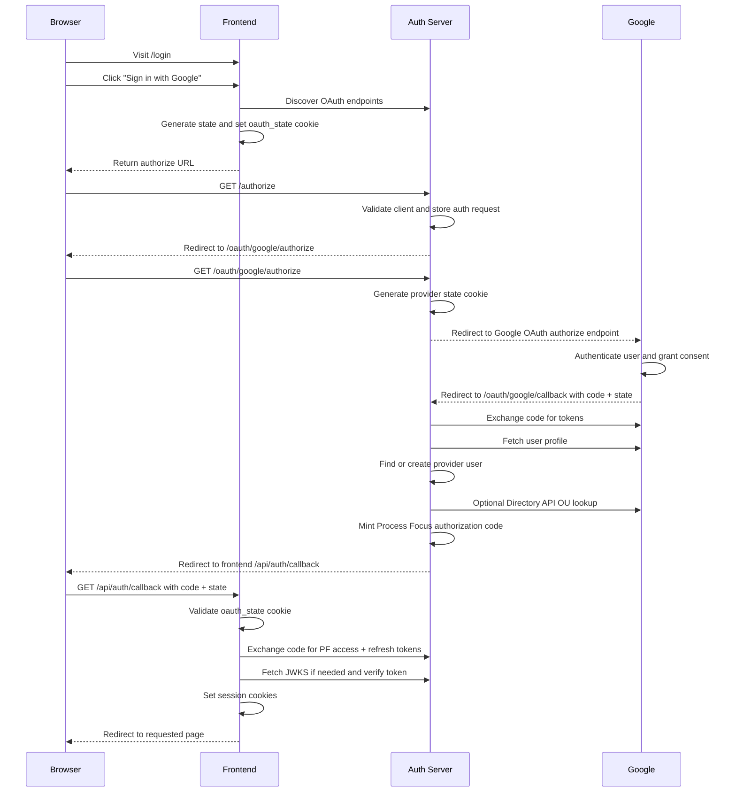

# Authentication Flow

This document describes the current frontend -> auth server -> Google flow used
by `@pf/auth-api` and `@pf/openauth`.

## Route Summary

- Frontend login start: `POST /api/auth/login`
- OAuth discovery: `GET /.well-known/oauth-authorization-server`
- Authorization request: `GET /authorize`
- Provider authorize: `GET /oauth/google/authorize`
- Provider callback: `GET /oauth/google/callback`
- Token exchange: `POST /token`
- JWKS: `GET /.well-known/jwks.json`

The provider routes are implemented in `packages/openauth/src/issuer.ts`.

## End-to-End Flow

Use placeholders rather than hard-coded localhost ports when copying this flow
into environment-specific docs:
- `<AUTH_SERVER_URL>`
- `<FRONTEND_URL>`

In local development the auth server may run on a fallback port. Check
`.auth-port.json` for the current local URL.

## Step-by-Step Breakdown

### 1. Frontend starts the OAuth flow

Files:
- `apps/frontend/app/login/login-button.tsx`
- `apps/frontend/app/api/auth/login/route.ts`

The frontend:
- receives the chosen provider from the login page
- builds the frontend callback URL `/api/auth/callback`
- calls `authClient.authorize()`
- stores the returned state in an httpOnly `oauth_state` cookie

### 2. Auth server starts provider auth

Files:
- `packages/openauth/src/client.ts`
- `packages/openauth/src/issuer.ts`

The auth server:
- exposes OAuth discovery at `/.well-known/oauth-authorization-server`
- validates `client_id` and `redirect_uri`
- stores the authorization request in an encrypted cookie
- redirects to `/oauth/google/authorize`

### 3. Google login and provider callback

Files:
- `packages/openauth/src/issuer.ts`
- `packages/openauth/src/provider/oauth2.ts`

The provider callback flow:
- stores a provider-specific state cookie before redirecting to Google
- exchanges Google's authorization code at `https://oauth2.googleapis.com/token`
- fetches the user's Google profile
- hands the result to auth-api success handling

The Google OAuth client redirect URI must be:
- `<AUTH_SERVER_URL>/oauth/google/callback`

## 4. Provider user lookup, invite handling, and OU lookup

Files:
- `packages/auth-api/src/lib/provider-user-auth.ts`
- `packages/auth-api/src/lib/google-directory.ts`

Auth-api then:
- finds an existing provider user by provider + subject
- optionally falls back by email for the dummy provider only
- checks explicit invitation roles
- if the provider is Google and OU invites are configured, calls the Google
  Workspace Directory API to fetch `orgUnitPath`
- throws `InviteRequiredError` when invite-only login is enabled and neither an
  explicit invite nor a matching OU invite exists

The Directory API lookup uses a service account with domain-wide delegation:
- `serviceAccountKey` is a base64-encoded service account JSON key
- `adminEmail` is impersonated as the JWT `sub`
- the token exchange uses
  `urn:ietf:params:oauth:grant-type:jwt-bearer`
- the requested scope is
  `https://www.googleapis.com/auth/admin.directory.user.readonly`

## 5. Auth server mints Process Focus tokens

Files:
- `packages/auth-api/src/lib/create-authentication-server.ts`
- `packages/openauth/src/issuer.ts`

After the provider user is resolved, the auth server:
- shapes the Process Focus session subject
- stores a short-lived authorization code
- exchanges that code for signed PF access and refresh tokens
- publishes signing keys through `/.well-known/jwks.json`

## 6. Frontend exchanges the PF code and establishes a session

Files:
- `apps/frontend/app/api/auth/callback/route.ts`
- `apps/frontend/lib/auth/session.ts`

The frontend callback handler:
- validates the `oauth_state` cookie using constant-time comparison
- exchanges the code with the auth server
- verifies the returned access token
- runs Cedar `canLogin` authorization
- sets session cookies and redirects to the original page

## Google Setup Checklist

For normal Google sign-in:
- configure a Google OAuth client for the auth server
- add `<AUTH_SERVER_URL>/oauth/google/callback` as an authorized redirect URI

For Google Workspace OU-based invites:
- enable `Admin SDK API` in the relevant Google Cloud project
- create or reuse a service account
- enable domain-wide delegation for that service account
- add the service account client ID to Workspace domain-wide delegation
- grant scope `https://www.googleapis.com/auth/admin.directory.user.readonly`
- set `serviceAccountKey` to the base64-encoded key JSON
- set `adminEmail` to a Workspace admin who can read users and org units

## Failure Modes

- `Failed to fetch user from Directory API`: the OU lookup call failed before a
  usable response came back. Check Admin SDK enablement, service account key,
  domain-wide delegation, granted scopes, and `adminEmail` permissions.
- `Authentication blocked: invite required`: login reached auth-api, but there
  was no explicit invite and no matching OU-based invite.
- Google redirect mismatch errors: the callback URL in Google Cloud Console does
  not exactly match the current auth server URL.
